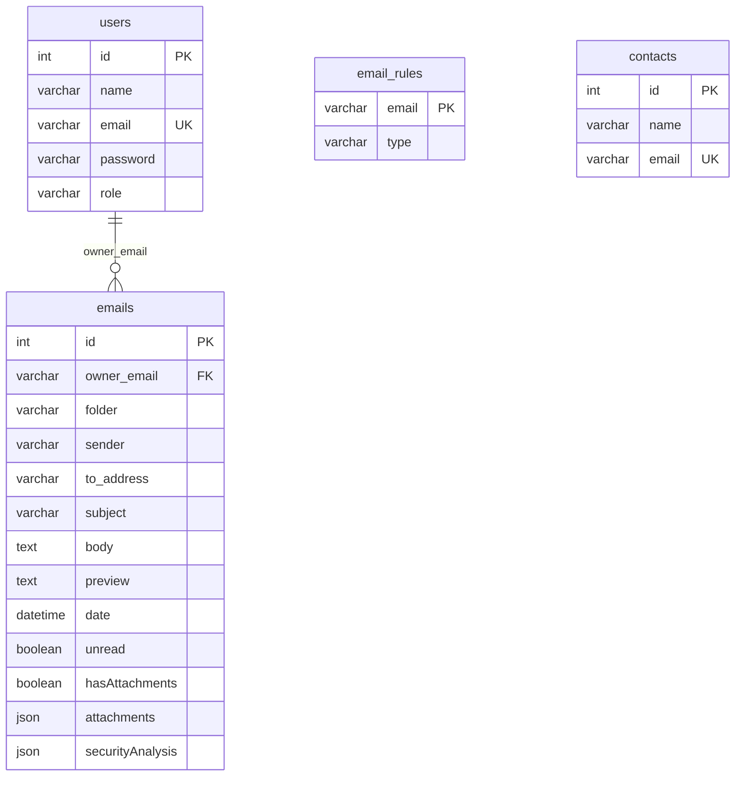

# Sistema de Correos - Análisis y Plan de Mejora

## 1. Resumen del Proyecto

Este proyecto es un cliente de correo web moderno llamado **Alhmail**, con un backend robusto que utiliza Node.js. La aplicación integra funcionalidades de inteligencia artificial.

### Componentes Principales:

- **Frontend (`Alhmail/`):** Una aplicación de React escrita en TypeScript, que utiliza Vite para el desarrollo y la compilación. Se encarga de la interfaz de usuario, la interacción con el usuario y la comunicación con el backend.
- **Backend (`api-server/`):** Un servidor de API construido con Node.js y Express.js. Gestiona la lógica de negocio, la interacción con la base de datos MySQL, la autenticación de usuarios y la integración con servicios de correo electrónico (IMAP y SMTP) y la API de Gemini para el análisis de seguridad.

### Tecnologías Utilizadas:

- **Frontend:** React, TypeScript, Vite, Google GenAI
- **Backend:** Node.js, Express.js, MySQL, Google GenAI, Nodemailer, imap-simple
- **Base de Datos:** MySQL

## 2. Análisis del Estado Actual

### Puntos Fuertes:

- **Arquitectura Moderna:** El uso de React con Vite y TypeScript en el frontend, y Node.js con Express en el backend, conforma un stack tecnológico moderno y de alto rendimiento.
- **Funcionalidad de IA:** La integración con la API de Gemini para clasificar y analizar correos electrónicos es una característica potente y distintiva.
- **Funcionalidad Básica Completa:** La aplicación ya implementa las funcionalidades esenciales de un cliente de correo: enviar, recibir, ver correos, gestión de carpetas y autenticación.
- **Buenas Prácticas:** Se utilizan variables de entorno para la configuración, lo cual es una buena práctica de seguridad. El uso de un pool de conexiones a la base de datos es bueno para el rendimiento.

### Áreas de Mejora:

#### **Arquitectura y Mantenibilidad:**

- **Backend Monolítico:** El archivo `api-server/node.js` contiene toda la lógica del backend (rutas, controladores, lógica de negocio), lo que dificulta su mantenimiento y escalabilidad.
- **Gestión de Estado en Frontend:** El estado global de la aplicación se gestiona en el componente principal `App.tsx` mediante `useState` y `useEffect`. A medida que la aplicación crezca, esto puede volverse difícil de manejar.

#### **Escalabilidad:**

- **Sincronización de Correo Ineficiente:** El backend sincroniza el buzón de Gmail cada 20 segundos (`setInterval`). Este método de polling no es escalable y puede llevar a problemas de rendimiento y a un alto consumo de recursos.
- **Diseño de la Base de Datos:** No se ha podido revisar el esquema de la base de datos, pero es crucial que esté bien diseñado y optimizado con los índices adecuados para soportar un crecimiento en el volumen de datos.

#### **Seguridad:**

- **Almacenamiento de Contraseñas:** Las contraseñas de los usuarios se almacenan en texto plano en la base de datos, lo cual es una vulnerabilidad de seguridad crítica.
- **Falta de Validación de Entradas:** No se realiza una validación exhaustiva de los datos de entrada en las rutas del API, lo que expone al sistema a ataques como inyección de SQL, XSS, etc.
- **Detección de Spam Básica:** El motor de detección de spam heurístico es muy básico y puede ser fácilmente eludido.

#### **Pruebas:**

- **Ausencia de Pruebas Automatizadas:** El proyecto carece de pruebas unitarias y de integración, lo que aumenta el riesgo de introducir errores al realizar cambios y dificulta la verificación de la funcionalidad existente.

## 3. Plan de Desarrollo de 2 Días

Este plan se enfoca en abordar las áreas de mejora más críticas para aumentar la seguridad, escalabilidad y mantenibilidad del proyecto.

### Día 1: Refactorización del Backend y Fortalecimiento de la Seguridad

1.  **Refactorizar la Arquitectura del Backend:**
    - Crear una estructura de directorios modular: `config/`, `routes/`, `controllers/`, `services/`, `middlewares/`.
    - Mover la configuración de la base de datos y otras configuraciones a `config/`.
    - Separar las rutas en archivos específicos por recurso en `routes/` (ej. `emails.js`, `users.js`).
    - Mover la lógica de negocio de las rutas a los controladores en `controllers/`.
    - Crear servicios para la lógica reutilizable (ej. `emailService.js`, `dbService.js`).
2.  **Implementar Hashing de Contraseñas:**
    - Utilizar la librería `bcrypt` para hashear las contraseñas antes de guardarlas en la base de datos.
    - Actualizar la lógica de registro y de login para que trabaje con las contraseñas hasheadas.
3.  **Añadir Validación de Entradas en el Backend:**
    - Integrar una librería como `joi` o `express-validator` para validar los datos de entrada en todas las rutas del API.
    - Definir esquemas de validación para los cuerpos de las peticiones (`body`), los parámetros de la URL (`params`) y las consultas (`query`).

### Día 2: Mejoras en el Frontend y Backend

1.  **Optimizar la Sincronización de Correo:**
    - Investigar e implementar el uso de `IDLE` en el protocolo IMAP para recibir notificaciones en tiempo real de nuevos correos, eliminando la necesidad de polling.
2.  **Introducir un Gestor de Estado en el Frontend:**
    - Integrar `Zustand` como gestor de estado global en la aplicación de React.
    - Migrar el estado global de `App.tsx` al store de Zustand para simplificar el manejo del estado y mejorar la componentización.
3.  **Escribir Pruebas Unitarias Iniciales:**
    - Configurar un entorno de pruebas con `Jest` y `Supertest` para el backend.
    - Escribir pruebas unitarias para los controladores y servicios más críticos.
    - Configurar `React Testing Library` en el frontend y escribir pruebas unitarias para algunos componentes clave.

## 4. Análisis de la Base de Datos y Mejoras

A continuación se presenta un diagrama de la base de datos inferido a partir del código del backend, junto con una serie de recomendaciones para mejorar su diseño, rendimiento y seguridad.

### Diagrama de la Base de Datos (Inferido)

### Puntos de Mejora de la Base de Datos:

1.  **Normalización:**
    - **Tabla `emails`:** El campo `owner_email` debería ser reemplazado por un `user_id` (clave foránea a `users.id`). Esto reduciría la redundancia de datos y mejoraría la integridad referencial.
    - **Tabla `email_rules`:** Debería tener su propio `id` como clave primaria. Además, debería estar vinculada a la tabla `users` a través de un `user_id` para que cada usuario pueda tener sus propias reglas.

2.  **Tipos de Datos:**
    - **`users.password`:** Este es el punto más crítico. Almacenar contraseñas en texto plano (`varchar`) es una grave vulnerabilidad de seguridad. Se debe utilizar un campo de tipo `char(60)` para almacenar el hash de la contraseña generado con `bcrypt`.

3.  **Indexación:**
    - Crear índices en las columnas que se utilizan frecuentemente en las cláusulas `WHERE`, como `emails.owner_email` (o `user_id` tras la normalización) y `emails.folder`.

4.  **Relaciones:**
    - **Tabla `contacts`:** No existe una relación explícita con la tabla `users`. Se debería añadir una clave foránea `user_id` para asociar los contactos a cada usuario.

5.  **Estructura de las Tablas:**
    - **Tabla `email_rules`:** La estructura actual es muy simple. Se podría ampliar para permitir reglas más complejas, como filtros por asunto, contenido del cuerpo del correo, etc.

## 5. Recomendaciones a Futuro

- **Mejorar el Motor de Seguridad:**
    - Integrar librerías más avanzadas para el análisis de correos, como `spamc` (cliente para SpamAssassin).
    - Entrenar un modelo de machine learning propio para la detección de spam y phishing, utilizando los datos recopilados.
- **Implementar WebSockets:**
    - Utilizar WebSockets para una comunicación en tiempo real entre el frontend y el backend, permitiendo notificaciones instantáneas de nuevos correos y otros eventos.
- **Añadir Más Pruebas:**
    - Ampliar la cobertura de las pruebas unitarias y de integración.
    - Implementar pruebas de extremo a extremo (E2E) con herramientas como `Cypress` o `Playwright`.
- **CI/CD:**
    - Configurar un pipeline de Integración Continua y Despliegue Continuo (CI/CD) con herramientas como GitHub Actions para automatizar las pruebas y los despliegues.
- **Contenerización:**
    - Utilizar `Docker` para contenerizar las aplicaciones de frontend y backend, facilitando el despliegue y la escalabilidad.
